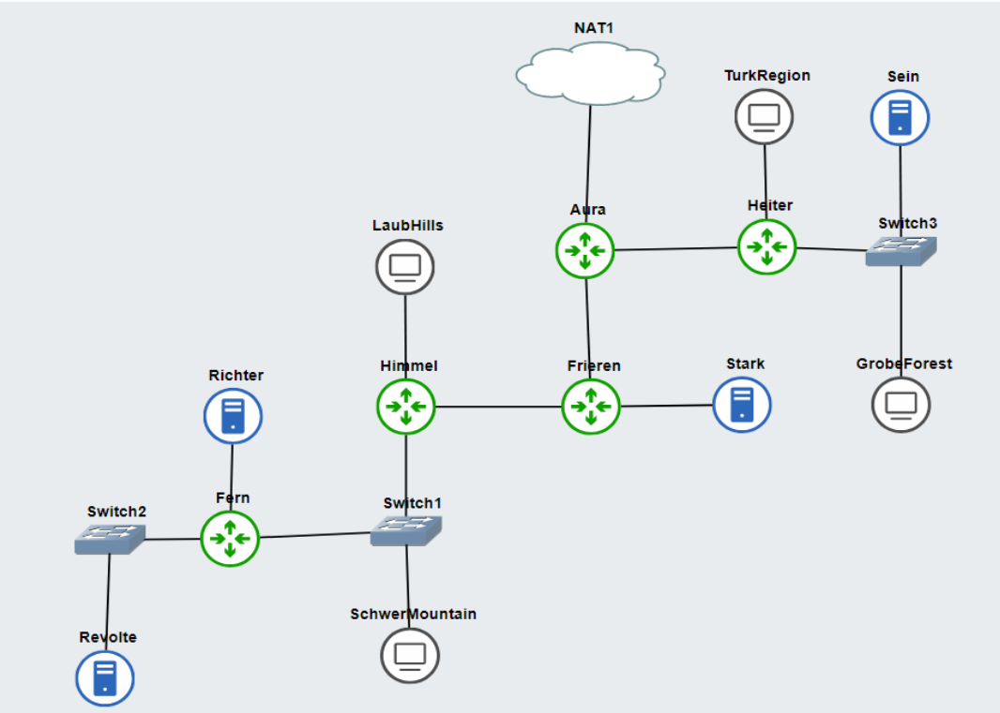

# Jarkom-Modul-5-D17-2023

**Praktikum Jaringan Komputer Modul 5 Tahun 2023**

# Author
| Nama | NRP |Github |
|---------------------------|------------|--------|
|Adam Haidar Azizi | 5025211114 | https://github.com/HADAIZI |
|Ahda Filza Ghaffaru | 5025211144 | https://github.com/Ahdaaa |


## **Soal Nomor 0**
Setelah pandai mengatur jalur-jalur khusus, kalian diminta untuk membantu North Area menjaga wilayah mereka dan kalian dengan senang hati membantunya karena ini merupakan tugas terakhir.

- Tugas pertama, buatlah peta wilayah sesuai berikut ini:

- Untuk menghitung rute-rute yang diperlukan, gunakan perhitungan dengan metode VLSM. Buat juga pohonnya, dan lingkari subnet yang dilewati.

- Kemudian buatlah rute sesuai dengan pembagian IP yang kalian lakukan. 

- Tugas berikutnya adalah memberikan ip pada subnet SchwerMountain, LaubHills, TurkRegion, dan GrobeForest menggunakan bantuan DHCP.

## **Penyelesaian Soal Nomor 0**
Setelah topologi berhasil dibuat pada GNS3, langkah selanjutnya yang dilakukan adalah membuat rute dan melakukan _subnetting_. Berikut adalah hasil dari pembuatan rute serta _subnetting_ yang sudah dilakukan:

- **Tree**


- **Rute**


- **Kongfigurasi setiap _node_** <br>

Berikut adalah kongfigurasi untuk tiap node dalam topologi pada soal praktikum:

- Aura

```shell
auto eth0
iface eth0 inet dhcp

auto eth1
iface eth1 inet static
	address 10.30.14.145
        netmask 255.255.255.252

auto eth2
iface eth2 inet static
	address 10.30.14.149
	netmask 255.255.255.252

```

- **Revolte**
```bash

auto eth0
iface eth0 inet static
	address 10.30.14.134
	netmask 255.255.255.252
	gateway 10.30.14.133
```

- **Richter**
```bash

auto eth0
iface eth0 inet static
	address 10.30.14.130
	netmask 255.255.255.252
	gateway 10.30.14.129
```

- **Fern**
```bash
auto eth0
iface eth0 inet static
	address 10.30.14.3
	netmask 255.255.255.128
        gateway 10.30.14.1

auto eth1
iface eth1 inet static
	address 10.30.14.129
	netmask 255.255.255.252

auto eth2
iface eth2 inet static
	address 10.30.14.133
	netmask 255.255.255.252


```

- **SchwerMountain**
```bash
auto eth0
iface eth0 inet dhcp
hwaddress ether fe:91:9a:1f:1d:bc
```

- **Himmel**
```bash
auto eth0
iface eth0 inet static
	address 10.30.14.142
	netmask 255.255.255.252
	gateway 10.30.14.141

auto eth1
iface eth1 inet static
	address 10.30.12.1
	netmask 255.255.254.0

auto eth2
iface eth2 inet static
	address 10.30.14.1
	netmask 255.255.255.128

```

- **LaubHills**
```bash
auto eth0
iface eth0 inet dhcp
hwaddress ether ca:98:ba:05:41:a3

```

- **Frieren**
```bash
auto eth0
iface eth0 inet static
	address 10.30.14.150
	netmask 255.255.255.252
	gateway 10.30.14.149

auto eth1
iface eth1 inet static
	address 10.30.14.137
	netmask 255.255.255.252

auto eth2
iface eth2 inet static
	address 10.30.14.141
	netmask 255.255.255.252


```

- **Stark**
```bash
auto eth0
iface eth0 inet static
	address 10.30.14.138
	netmask 255.255.255.252
	gateway 10.30.14.137

```

- **Heiter**
```bash
auto eth0
iface eth0 inet static
	address 10.30.14.146
	netmask 255.255.255.252
	gateway 10.30.14.145

auto eth1
iface eth1 inet static
	address 10.30.0.1
	netmask 255.255.248.0

auto eth2
iface eth2 inet static
	address 10.30.8.1
	netmask 255.255.252.0
```

- **TurkRegion**
```bash
#A9
auto eth0
iface eth0 inet dhcp
hwaddress ether 52:22:61:b7:6c:e3

```

- **Sein**
```bash
auto eth0
iface eth0 inet static
	address 10.30.8.2
	netmask 255.255.252.0
	gateway 10.30.8.1

```

- **GrobeForest**
```bash
auto eth0
iface eth0 inet dhcp
hwaddress ether 7e:62:3d:83:91:4e
```

## DHCP Server + Relay Config

Tugas berikutnya adalah memberikan ip pada subnet SchwerMountain, LaubHills, TurkRegion, dan GrobeForest menggunakan bantuan DHCP.

* Revolte

```sh
apt update
apt install isc-dhcp-server -y

echo '
INTERFACESv4="eth0"
' > /etc/default/isc-dhcp-server

echo '
subnet 10.30.14.132 netmask 255.255.255.252 {
        option routers 10.30.14.133;
        option broadcast-address 10.30.14.135;
}
subnet 10.30.14.128 netmask 255.255.255.252 { 
        option routers 10.30.14.129;
        option broadcast-address 10.30.14.131;
}
subnet 10.30.14.0 netmask 255.255.255.128 {
        option routers 10.30.14.1;
        option broadcast-address 10.30.14.127;
		default-lease-time 720;
        max-lease-time 5760;
}
subnet 10.30.12.0 netmask 255.255.254.0 {
        option routers 10.30.12.1;
        option broadcast-address 10.30.13.255;
        default-lease-time 720;
        max-lease-time 5760;
}
subnet 10.30.14.140 netmask 255.255.255.252 {
        option routers 10.30.14.141;
        option broadcast-address 10.30.14.143;
}
subnet 10.30.14.136 netmask 255.255.255.252 {
        option routers 10.30.14.137;
        option broadcast-address 10.30.14.139;
}
subnet 10.30.14.148 netmask 255.255.255.252 {
        option routers 10.30.14.149;
        option broadcast-address 10.30.14.151;
}
subnet 10.30.8.0 netmask 255.255.252.0 {
        option routers 10.30.8.1;
        option broadcast-address 10.30.11.255;
}
subnet 10.30.0.0 netmask 255.255.248.0 {
        option routers 10.30.0.1;
        option broadcast-address 10.30.7.255;
}
subnet 10.30.14.144 netmask 255.255.255.252 {
        option routers 10.30.14.145;
        option broadcast-address 10.30.14.147;
}

host SchwerMountain  {
    hardware ethernet fe:91:9a:1f:1d:bc;
    fixed-address 10.30.14.2;
}

host LaubHills {
    hardware ethernet ca:98:ba:05:41:a3;
    fixed-address 10.30.12.2;
}

host TurkRegion {
    hardware ethernet 52:22:61:b7:6c:e3;
    fixed-address 10.30.0.2;
}

host GrobeForest {
    hardware ethernet 7e:62:3d:83:91:4e;
    fixed-address 10.30.8.3;
}

' > /etc/dhcp/dhcpd.conf

service isc-dhcp-server stop
service isc-dhcp-server start
```

* Relay di tiap router lain

```sh
apt-get update
apt-get install isc-dhcp-relay -y
service isc-dhcp-relay start

echo '
SERVERS="10.30.14.134"
INTERFACES="eth0 eth1 eth2"
OPTIONS=""
' > /etc/default/isc-dhcp-relay

echo '
net.ipv4.ip_forward=1
' > /etc/sysctl.conf

service isc-dhcp-relay restart
```

## Soal 1

> Agar topologi yang kalian buat dapat mengakses keluar, kalian diminta untuk mengkonfigurasi Aura menggunakan iptables, tetapi tidak ingin menggunakan MASQUERADE.

```sh
# Nomor 1
ip_aura=$(ip -4 addr show eth0 | grep -oP '(?<=inet\s)\d+(\.\d+){3}')
iptables -t nat -A POSTROUTING -o eth0 -j SNAT --to-source $ip_aura
```

## Soal 2

> Kalian diminta untuk melakukan drop semua TCP dan UDP kecuali port 8080 pada TCP.

```sh
echo 'nameserver 192.168.122.1' > /etc/resolv.conf

apt-get update
apt-get install netcat -y

# Drop semua TCP kecuali port 8080 TCP
iptables -A INPUT -p tcp --dport 8080 -j ACCEPT
iptables -A INPUT -p tcp -j DROP

# Drop UDP
iptables -A INPUT -p udp -j DROP
```

## Soal 3

> Kepala Suku North Area meminta kalian untuk membatasi DHCP dan DNS Server hanya dapat dilakukan ping oleh maksimal 3 device secara bersamaan, selebihnya akan di drop.

```sh
 Izinkan koneksi
iptables -A INPUT -m state --state ESTABLISHED,RELATED -j ACCEPT

# Ping Maksimal 3 Device
iptables -A INPUT -p icmp -m connlimit --connlimit-above 3 --connlimit-mask 0 -j DROP
```

## Soal 4

> Lakukan pembatasan sehingga koneksi SSH pada Web Server hanya dapat dilakukan oleh masyarakat yang berada pada GrobeForest.

```sh
# Ambil NETID Subnet dimana GrobeForest berada.
iptables -A INPUT -p tcp --dport 22 -s 10.30.8.0/22 -j ACCEPT
iptables -A INPUT -p tcp --dport 22 -j DROP
```

## Soal 5

> Selain itu, akses menuju WebServer hanya diperbolehkan saat jam kerja yaitu Senin-Jumat pada pukul 08.00-16.00.

```sh
# Akses webserver di hari senin-jumat
iptables -A INPUT -p tcp --dport 80 -m time --timestart 08:00 --timestop 16:00 --weekdays Mon,Tue,Wed,Thu,Fri -j ACCEPT
```

## Soal 6

> Lalu, karena ternyata terdapat beberapa waktu di mana network administrator dari WebServer tidak bisa stand by, sehingga perlu ditambahkan rule bahwa akses pada hari Senin - Kamis pada jam 12.00 - 13.00 dilarang (istirahat maksi cuy) dan akses di hari Jumat pada jam 11.00 - 13.00 juga dilarang (maklum, Jumatan rek).

```sh
# Larang Senin-Kamis 12-13
iptables -A INPUT -p tcp --dport 80 -m time --timestart 12:00 --timestop 13:00 --weekdays Mon,Tue,Wed,Thu -j DROP

# Larang Jumat 11-13
iptables -A INPUT -p tcp --dport 80 -m time --timestart 11:00 --timestop 13:00 --weekdays Fri -j DROP
```

## Soal 7

> Karena terdapat 2 WebServer, kalian diminta agar setiap client yang mengakses Sein dengan Port 80 akan didistribusikan secara bergantian pada Sein dan Stark secara berurutan dan request dari client yang mengakses Stark dengan port 443 akan didistribusikan secara bergantian pada Sein dan Stark secara berurutan.

* Webserver Configs

```sh
echo 'nameserver 192.168.122.1' > /etc/resolv.conf

apt update
apt install netcat -y
apt install apache2 -y
service apache2 start

echo '
Listen 80
Listen 443

<IfModule ssl_module>
        Listen 443
</IfModule>

<IfModule mod_gnutls.c>
        Listen 443
</IfModule>
 > /etc/apache2/ports.conf

echo ' INI DARI SEIN ' > /var/www/html/index.html

echo '
<VirtualHost *:80>
    ServerName 10.30.8.2
    DocumentRoot /var/www/html
    ErrorLog ${APACHE_LOG_DIR}/error.log
    CustomLog ${APACHE_LOG_DIR}/access.log combined
/VirtualHost>
<VirtualHost *:443>
    ServerName 10.30.8.2
    DocumentRoot /var/www/html
    ErrorLog ${APACHE_LOG_DIR}/error.log
    CustomLog ${APACHE_LOG_DIR}/access.log combined
</VirtualHost>
' > /etc/apache2/sites-available/sein.conf

a2ensite /etc/apache2/sites-available/sein.conf
service apache2 restart
```

* Routing

```sh
iptables -A PREROUTING -t nat -p tcp --dport 80 -d 10.30.8.2 -m statistic --mode nth --every 2 --packet 0 -j DNAT --to-destination 10.30.8.2:80
iptables -A PREROUTING -t nat -p tcp --dport 80 -d 10.30.8.2 -j DNAT --to-destination 10.30.14.138:80
iptables -A PREROUTING -t nat -p tcp --dport 443 -d 10.30.14.138 -m statistic --mode nth --every 2 --packet 0 -j DNAT --to-destination 10.30.14.138:443
iptables -A PREROUTING -t nat -p tcp --dport 443 -d 10.30.14.138 -j DNAT --to-destination 10.30.8.2:443
```

## Soal 8

> Karena berbeda koalisi politik, maka subnet dengan masyarakat yang berada pada Revolte dilarang keras mengakses WebServer hingga masa pencoblosan pemilu kepala suku 2024 berakhir. Masa pemilu (hingga pemungutan dan penghitungan suara selesai) kepala suku bersamaan dengan masa pemilu Presiden dan Wakil Presiden Indonesia 2024.

```sh
# Soal 8
iptables -A INPUT -p tcp -s 10.30.14.134 --dport 80 -m time --datestart 2023-10-19T00:00 --datestop 2024-02-15T00:00 -j DROP

iptables -A INPUT -s 10.30.14.134 -m time --datestart 2023-10-19T00:00 --datestop 2024-02-15T00:00 -j DROP
```

## Soal 9 

> Sadar akan adanya potensial saling serang antar kubu politik, maka WebServer harus dapat secara otomatis memblokir  alamat IP yang melakukan scanning port dalam jumlah banyak (maksimal 20 scan port) di dalam selang waktu 10 menit. 

```sh
iptables -N portscan

iptables -A INPUT -m recent --name portscan --update --seconds 600 --hitcount 20 -j DROP
iptables -A FORWARD -m recent --name portscan --update --seconds 600 --hitcount 20 -j DROP

iptables -A INPUT -m recent --name portscan --set -j ACCEPT
iptables -A FORWARD -m recent --name portscan --set -j ACCEPT
```

## Soal 10

> Karena kepala suku ingin tau paket apa saja yang di-drop, maka di setiap node server dan router ditambahkan logging paket yang di-drop dengan standard syslog level. 

```sh
ptables -A INPUT -j LOG --log-level debug --log-prefix "Dropped Packet: " -m limit --limit 1/second --limit-burst 10
```